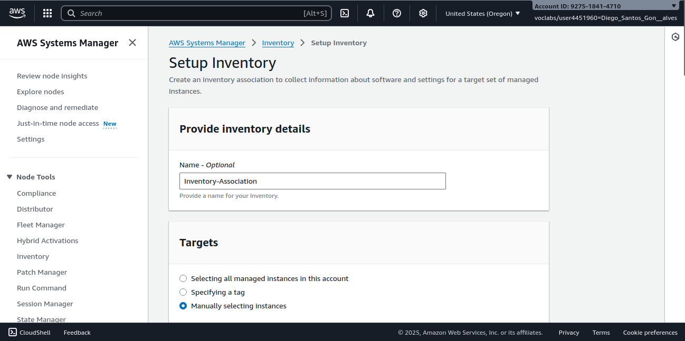
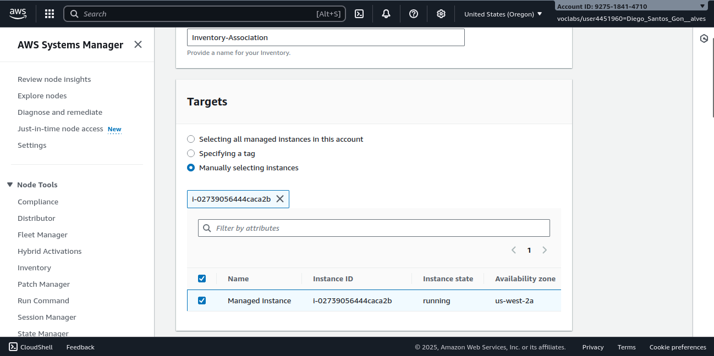
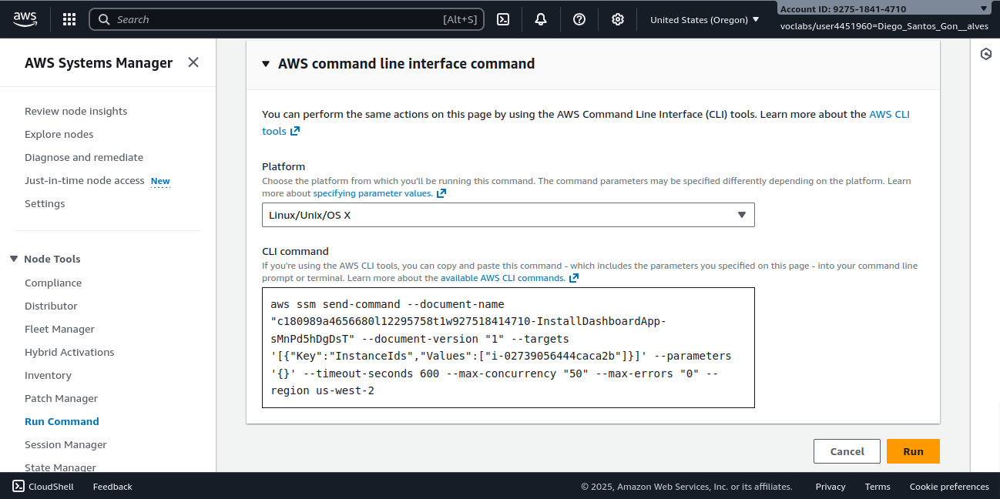
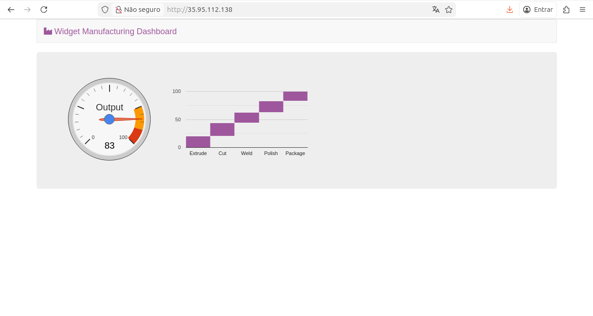
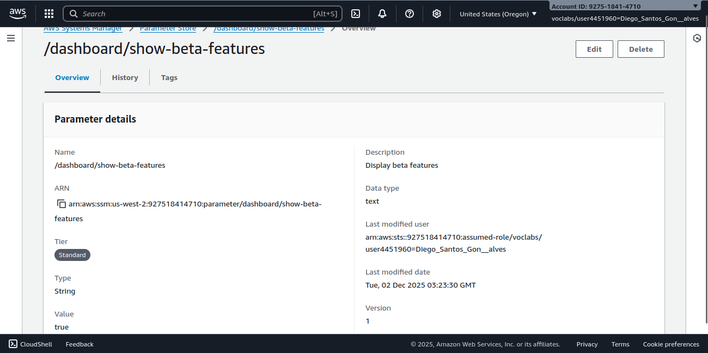
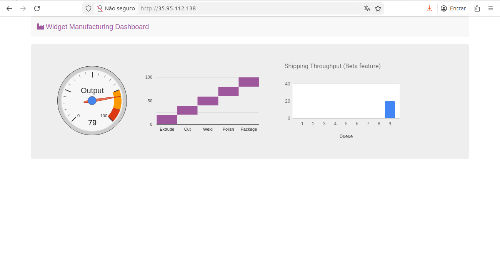
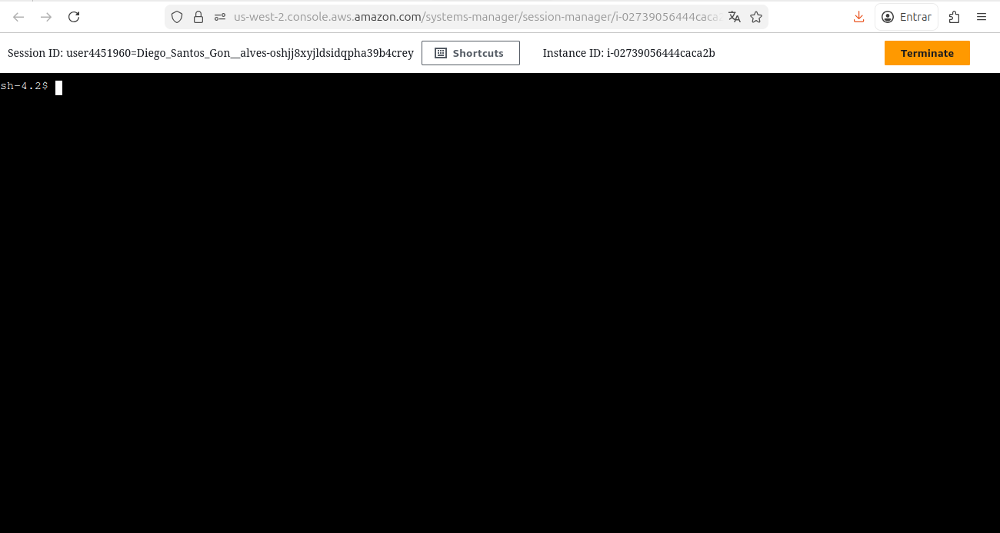
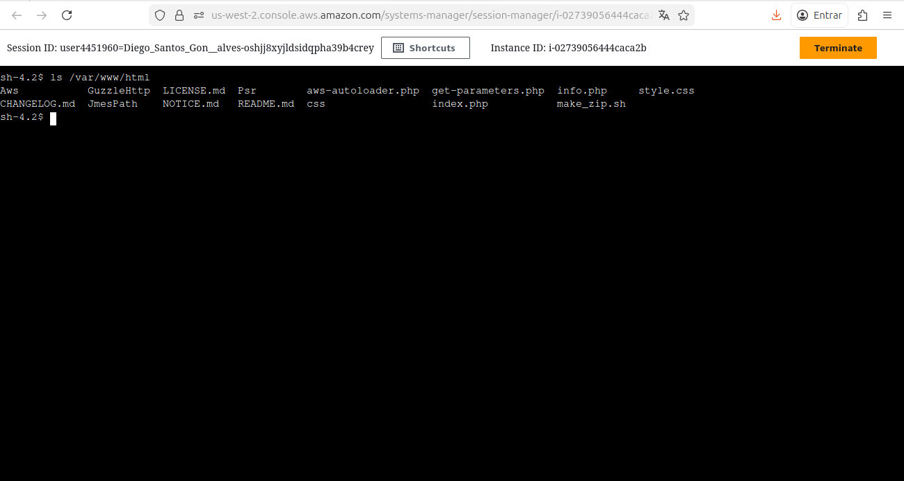
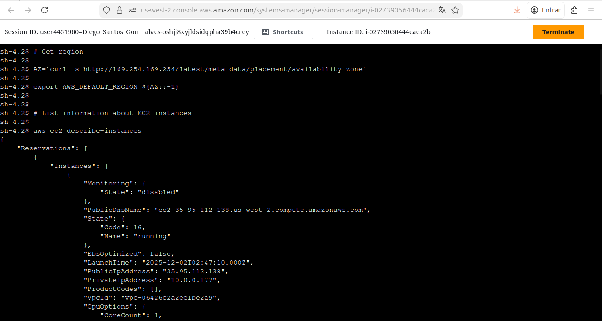

# 🤖 Documentação: Automação e Gerenciamento com AWS Systems Manager

Este projeto documenta a execução prática de um laboratório envolvendo **AWS Systems Manager**, com foco em inventário, automação, gerenciamento de parâmetros e acesso remoto seguro a instâncias EC2.

A atividade foi realizada como parte do programa **AWS re/Start - Escola da Nuvem ☁️**.

---

## 🧠 Habilidades Desenvolvidas

* Inventário de instâncias com **Fleet Manager**
* Execução de comandos e automação com **Run Command**
* Configuração dinâmica de aplicações com **Parameter Store**
* Acesso seguro a instâncias sem SSH com **Session Manager**
* Gerenciamento de infraestrutura sem login manual na instância
* Monitoramento e auditoria de operações

---

## 🛠️ Tecnologias Utilizadas

<div align="left">

  
  
  
  
  

</div>

---

## 📁 Estrutura do Repositório

```
aws-systems-manager-lab/
├── imagens/               # Imagens do laboratório
└── README.md                  # Este documento
```

---

# 🧪 Laboratório: AWS Systems Manager

## 1️⃣ Inventariando Instâncias com Fleet Manager

O objetivo desta etapa foi:

* Ativar o inventário da instância EC2
* Coletar dados de sistema e softwares instalados
* Monitorar configurações sem conectar via SSH

### 🔧 Procedimentos

* Acessar **Systems Manager > Fleet Manager**
* Configurar **Inventory-Association**
* Selecionar instância manualmente
* Confirmar criação da associação

### 📝 Resultado

A instância passou a reportar dados automaticamente, incluindo:

* Sistema operacional
* Aplicações instaladas
* Informação de hardware

#### 📸 Print





---

## 2️⃣ Instalando Aplicação com Run Command

Nesta etapa, usamos **Run Command** para instalar automaticamente:

* Apache
* PHP
* AWS SDK
* Widget Dashboard

### 🔧 Procedimentos

* Acessar **Run Command**
* Selecionar documento customizado
* Selecionar instância manualmente
* Executar comando

#### 📸 Print



### ✔️ Resultado

Após a execução, a página web ficou disponível:

```
http://35.95.112.138/
```

#### 📸 Print



---

## 3️⃣ Gerenciamento de Configurações com Parameter Store

Implementamos um parâmetro para habilitar recursos beta no aplicativo.

### 🔧 Procedimentos

* Acessar **Parameter Store**
* Criar parâmetro:

| Campo | Valor                         |
| ----- | ----------------------------- |
| Name  | /dashboard/show-beta-features |
| Value | True                          |
| Type  | String                        |

#### 📸 Print



### ✔️ Resultado

Após atualizar a página, o dashboard exibiu um novo gráfico ativado dinamicamente.

#### 📸 Print



---

## 4️⃣ Acessando Instâncias com Session Manager

Nesta etapa acessamos a instância sem:

* SSH
* Porta 22 aberta
* Chave privada

### 🔧 Procedimentos

* Acessar **Session Manager**
* Iniciar sessão na instância
* Executar comandos

#### 📸 Print



### 🧪 Comandos Executados

Listar arquivos da aplicação:

```bash
ls /var/www/html
```



Obter informações de instâncias pela CLI:

```bash
AZ=`curl -s http://169.254.169.254/latest/meta-data/placement/availability-zone`
export AWS_DEFAULT_REGION=${AZ::-1}
aws ec2 describe-instances
```



## 🏗️ Arquitetura do laboratório


### ✔️ Benefícios

* Zero administração de chaves SSH
* Auditoria via CloudTrail
* Segurança reforçada

---

# 🏁 Conclusão

Ao final do laboratório, foi possível:

✔️ Validar configurações e inventário
✔️ Automatizar instalação de software
✔️ Atualizar configurações da aplicação em tempo real
✔️ Acessar instância de forma segura sem SSH

Essas práticas demonstram o poder do **gerenciamento centralizado e automatizado de infraestrutura** com AWS Systems Manager.

---

⚠️ ***Observação***

Este laboratório foi realizado em um **ambiente sandbox da AWS**, disponibilizado apenas para fins educacionais. Nesse tipo de ambiente, o acesso é temporário e os **recursos são automaticamente encerrados e excluídos ao final da sessão**.

Informações como **Account ID ou nome do usuário do laboratório podem aparecer nos prints**, mas **não representam risco de segurança**, pois não pertencem a uma conta real e não permitem qualquer acesso externo.

---
